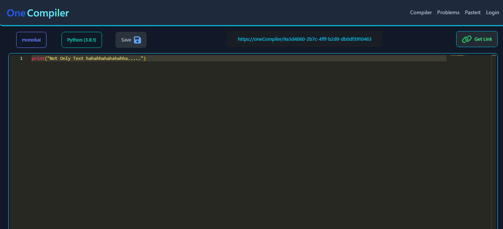

<span style="color: blue; font-size: 40px">One</span>
<span style="color: cyan; font-size: 40px">Compiler</span>

### OneCompiler is an advanced, fully responsive web application designed to cater to developers, students, and coding enthusiasts of all levels.

## Features

- Open Compiler
- Fully Responsive UI
- 1000+ Problems
- Pasteit
- CRUD based Account
- JWT Authentication
- Many more... expolre it.

### Usage :

- (To Run Locally) Need 2 Terminal

- - ### Terminal 1 (Frontend)

```bash
git clone https://github.com/Roshan-Here/OneCompiler.git
cd OneCompiler/client/
npm install
npm run dev
python manage.py runserver
```

- - ### Terminal 2 (Backend)

```bash
git clone https://github.com/Roshan-Here/OneCompiler.git
cd OneCompiler/backend/
pip install -r requirments.txt
python manage.py makemigrations api
python manage.py migrate api
python manage.py makemigrations
python manage.py migrate
python mange.py runserver
```

### Results





<p style='font-size: 20px'> 
<a href='https://one-compiler.vercel.app/'> And much more, explore </a>
</p>

<h3 style="margin-top:4%"><a href="https://github.com/Roshan-Here/OneCompiler/blob/development/LICENSE">GNU General Public License v3.0</a></h3>
